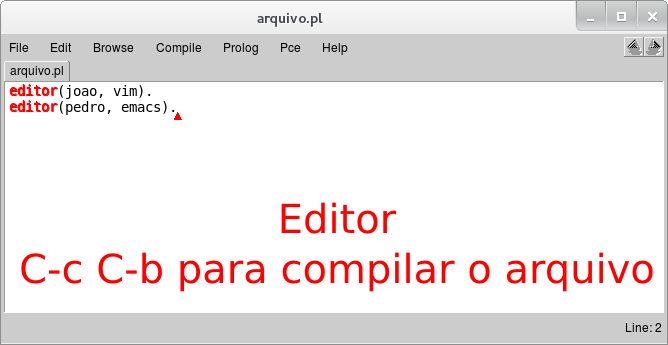
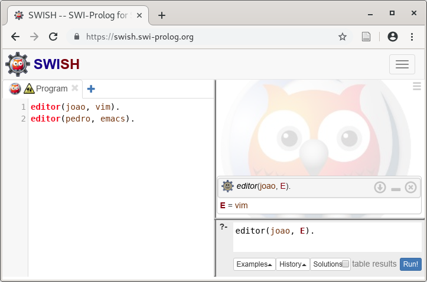

Introdução
==========

## Introdução

No paradigma de **programação declarativo**, as estruturas e os elementos do
programa são escritos de maneira a especificar a lógica da computação sem
descrever o fluxo de controle.


## Imperativo vs declarativo

- Imperativo

    - Modelo de computação baseado em sequência passo a passo de comandos

    - Atribuições destrutivas

    - Ordem de execução é crucial, os comandos só podem ser entendidos no
      contexto das computações anteriores devido aos efeitos colaterais

    - Controle é responsabilidade do programador

    - Exemplos: Java, C, Pascal


## Imperativo vs declarativo

- Declarativo

    - Modelo de computação baseado em um sistema onde as relações são
      especificadas diretamente em termos da entrada

    - Atribuição não destrutiva

    - A ordem de execução não importa (não tem efeitos colaterais)

    - O programador não é responsável pelo controle

    - Exemplos: SQL, Prolog, Haskell


## Imperativo vs declarativo

- Alguns autores consideram "como" (imperativo) vs "o que" (declarativo)


## Paradigmas declarativos

- Os principais paradigmas declarativos são

    - Funcional

    - Lógico

    - Por restrições


## Funcional vs lógico

- Funcional

    - Baseado em declaração e aplicação de funções (cálculo lambda)

    - Todos os parâmetro de uma função precisam estar instanciados

    - Clara distinção entre entrada e saída


## Funcional vs lógico

- Lógico

    - Baseado no cálculo de predicados

    - Objetos e relações

    - A computação é feita usando um mecanismo de inferência lógico

    - A computação pode ser realizada com variáveis não instanciadas


## Prolog

- Para estudar o paradigma lógico vamos utilizar a linguagem Prolog

    - Existem muitas implementações

    - Vamos utilizar o [SWI-Prolog](http://www.swi-prolog.org)


## Instalação e execução

- Instalação

    ```sh
    $ apt-get install swi-prolog
    ```

- Execução

    ```sh
    $ swipl
    ```


## Edição e consulta com editor integrado

\scriptsize

```sh
Welcome to SWI-Prolog (threaded, 64 bits, version 8.0.2)
SWI-Prolog comes with ABSOLUTELY NO WARRANTY. This is free software.
Please run ?- license. for legal details.
For online help and background, visit http://www.swi-prolog.org
For built-in help, use ?- help(Topic). or ?- apropos(Word).

?- emacs('arquivo.pl'). # Edita arquivo.pl
true.

?- editor(joao, E).     # Consula
E = vim.                # Resultado
```


## Edição e consulta com editor integrado




## Edição e consulta com editor web swish




## Edição e consulta com outro editor

- Editar o arquivo usando o editor de sua preferência

- Ler o arquivo no swipl

    ```prolog
    ?- consult('arquivo.pl').
    ```

- Fazer consultas

    ```prolog
    ?- editor(joao, E).
    E = emacs.
    ```

- Depois de alterar o arquivo, ele deve ser lido novamente


Tutorial
========


## Tutorial

<!-- TODO: Adicionar definição de relação e fazer comparação com função !-->

- Neste tutorial não seremos muito formais

- Programar em Prolog consiste em

    - Especificar fatos sobre objetos e suas relações

    - Definir regras sobre objetos e suas relações

    - Fazer consultas (perguntas) sobre objetos e suas relações


## Fatos

- Um fato é algo que é verdadeiro sobre uma relação de objetos

- Exemplo de fato

    - João utiliza o editor vim

        ```prolog
        editor(joao, vim).
        ```

    - `joao` e `vim` são objetos

    - `editor` é uma relação


## Fatos

- Os nomes das relações e dos objetos devem começar com letras minúsculas

- A ordem dos objetos é arbitrária, mas você deve ser consistente

- Os objetos de uma relação são chamados de argumentos

- O nome da relação é chamado de predicado

- O número de argumentos de um predicado é a aridade do predicado


## Fatos

- Uma relação pode ter qualquer quantidade de argumentos

- Fato: Está chovendo. \pause

    ```prolog
    chovendo.
    ```

    \pause

- Fato: Maria comprou um livro do Jorge. \pause

    ```prolog
    comprou(maria, livro, jorge).
    ```


## Consultas

- Podemos fazer consultas sobre os fatos que foram definidos

- A forma de uma consulta é similar a de um fato


## Consultas

- Dado os seguintes fatos

    ```prolog
    editor(joao, vim).
    editor(pedro, emacs).
    ```

- Podemos fazer algumas consultas

    - É verdade que o João utiliza o editor vim? \pause

        ```prolog
        ?- editor(joao, vim).
        true.
        ```

        \pause

    - É verdade que o João utiliza o editor emacs? \pause

        ```prolog
        ?- editor(joao, emacs).
        false.
        ```


## Consultas

- Quando uma consulta é realizada o Prolog faz uma busca sequencial por fatos
  que unificam com o termo que está sendo consultado

    - Dois termos unificam se os predicados são os mesmos e cada argumento
      correspondente é o mesmo

- Se um fato que unifica com a consulta for encontrado, o Prolog irá responder
  `true`{.prolog}, caso contrário o Prolog responderá `false`{.prolog}

- A resposta `false`{.prolog} significa que não foi encontrado um fato que
  unifica com a questão


## Consultas

- Fatos

    ```prolog
    humano(socrates).
    humano(aristoteles).

    ateniense(socrates).
    ```

- Consulta \pause

    ```prolog
    ?- ateniense(aristoteles).
    false.
    ```

- Apesar de poder ser verdade no mundo real que Aristóteles era ateniense
  (viveu em Atenas), nós não podemos provar isto a partir dos fatos dados


## Variáveis

- Para fazer perguntas que as respostas não sejam apenas `true`{.prolog}
  e `false`{.prolog} usamos variáveis

- As variáveis começam com letra maiúscula


## Variáveis

- Fatos

    ```prolog
    editor(joao, vim).
    editor(joao, emacs).
    editor(pedro, emacs).
    ```

- Consulta

    - Existe algum `E`{.prolog} tal que Pedro utiliza o editor `E`{.prolog}?
      \pause

        ```prolog
        ?- editor(pedro, E).
        E = emacs.
        ```


## Variáveis

- O Prolog realiza uma busca da mesma forma que antes, mas considera que uma
  variável não instanciada unifica com qualquer objeto

- Quando o Prolog encontra um fato que unifica com a consulta, ele marca o fato
  e exibe os valores unificados com as variáveis

    - Se o utilizador pressionar \keys{\return} a busca é finalizada

    - Se o utilizador pressionar \keys{;} a busca é reiniciada a partir da
      marca


## Variáveis

- Fatos

    ```prolog
    editor(joao, vim).
    editor(joao, emacs).
    editor(pedro, emacs).
    ```

- Consulta

    - Existe algum `E`{.prolog} tal que João utiliza o editor `E`{.prolog}? \pause

        ```prolog
        ?- editor(joao, E).
        E = vim ;
        E = emacs.
        ```


## Conjunções

- Também é possível fazer consultas mais elaboradas usando conjunções (e)


## Conjunções

- Fatos

    ```prolog
    editor(joao, vim).
    editor(joao, emacs).
    editor(pedro, emacs).
    editor(maria, vim).
    ```

- Consultas

    - João e Pedro utilizam o editor emacs?

    - João utiliza o editor emacs e Pedro utiliza o editor emacs? \pause

        ```prolog
        ?- editor(joao, emacs), editor(pedro, emacs).
        true.
        ```

- O símbolo "," é pronunciado "e"


## Conjunções

- Quando uma sequência de metas separadas por vírgula é dada para o Prolog, ele
  tenta satisfazer uma meta por vez

- Todas as metas devem ser satisfeitas para a consulta ser satisfeita


## Conjunções

- Fatos

    ```prolog
    editor(joao, vim).
    editor(joao, emacs).
    editor(pedro, emacs).
    editor(maria, vim).
    ```

- Consulta

    - Existe algum `E`{.prolog} tal que João e Maria utilizam o editor
      `E`{.prolog}? De outra forma: existe algum `E`{.prolog} tal que João
      utiliza o editor `E`{.prolog} e Maria utiliza o editor `E`{.prolog}?
      \pause

        ```prolog
        ?- editor(joao, E), editor(maria, E).
        E = vim ;
        false.
        ```


## Conjunções

- Fatos

    \small

    ```prolog
    editor(joao, vim).
    editor(joao, emacs).
    editor(pedro, emacs).
    editor(maria, vim).
    ```

    \normalsize

- Consulta

    - Existem `X`{.prolog} e `Y`{.prolog} tal que `X`{.prolog} e `Y`{.prolog}
      utilizam o editor emacs? De outra forma: existem `X`{.prolog}
      e `Y`{.prolog} tal que `X`{.prolog} utiliza o editor emacs e `Y`{.prolog}
      utiliza o editor emacs? \pause

        \small

        `?- editor(X, emacs), editor(Y, emacs).`{.prolog} \pause \newline
        `X = Y, Y = joao ;`{.prolog} \pause \newline
        `X = joao, Y = pedro ;`{.prolog} \pause \newline
        `X = pedro, Y = joao ;`{.prolog} \pause \newline
        `X = Y, Y = pedro.`{.prolog}


## Conjunções

- Fatos

    \small

    ```prolog
    editor(joao, vim).
    editor(joao, emacs).
    editor(pedro, emacs).
    editor(maria, vim)
    ```

    \normalsize

- Consulta

    - Existem `X`{.prolog} e `Y`{.prolog} tal que `X`{.prolog} e `Y`{.prolog}
      utilizam o editor emacs e o nome de `X`{.prolog} "vem antes" que o de
      `Y`{.prolog}? \pause

        ```prolog
        ?- editor(X, emacs), editor(Y, emacs), X @< Y.
        X = joao,
        Y = pedro ;
        false.
        ```


## Conjunções

- Fatos

    ```prolog
    editor(joao, vim).
    editor(joao, emacs).
    editor(pedro, emacs).
    editor(maria, vim).
    ```

- Consulta

    - Existem `X`{.prolog}, `Y`{.prolog} e `Z`{.prolog} tal que `X`{.prolog}
      e `Y`{.prolog} utilizam o editor `Z`{.prolog}? \pause

        ```prolog
        ?- editor(X, Z), editor(Y, Z).
        ```

    - Qual é a resposta?


## Regras

- Forma de abstração utilizada pelo Prolog

- Usamos regras para dizer que um fato depende de um outro grupo de fatos

- Uma **regra** é um sentença genérica sobre objetos e suas relações

## Exemplo de regra

- Dois programadores podem fazer um par para programação se eles
  utilizam o mesmo editor \pause

    ```prolog
    par(X, Y) :-
        editor(X, Z),
        editor(Y, Z),
        X @< Y.
    ```


Exemplos
========


## Coloração de mapa

<!-- TODO: diagrama tikz -->

Defina um predicado `coloracao(A, B, C, D, E)`{.prolog} que é verdadeiro se
`A`{.prolog}, `B`{.prolog}, `C`{.prolog}, `D`{.prolog} e `E`{.prolog} são cores
que podem colorir as respectivas regiões do mapa abaixo de maneira que duas
regiões adjacentes não tenham a mesma cor.

```text
+-------+-------+
|   A   |   C   |
|       +-------+
+-------|   D   |
|   B   +-------+
|       |   E   |
+-------+-------+
```


## Coloração de mapa

<div class="columns">
<div class="column" width="30%">
\small

```text
+-------+-------+
|   A   |   C   |
|       +-------+
+-------|   D   |
|   B   +-------+
|       |   E   |
+-------+-------+
```
</div>
<div class="column" width="70%">
\small

```prolog
%% colocarao(A?, B?, C?, D?, E?) is nondet
%
%  Verdadeiro se A, B, C, D, E são cores que
%  podem colorir as respectivas regiões do
%  mapa exemplo de maneira que duas regiões
%  adjacentes não tenham a mesma cor.
```

\pause


```prolog
coloracao(A, B, C, D, E) :-
    cor_dif(A, C),
    cor_dif(A, D),
    cor_dif(A, B),
    cor_dif(B, D),
    cor_dif(B, E),
    cor_dif(C, D),
    cor_dif(D, E).
```
</div>
</div>


## Coloração de mapa

<div class="columns">
<div class="column" width="50%">
```prolog
%% cor_dif(A?, B?) is nondet
%
%  Verdeiro se A é uma cor
%  diferente da cor B.
```

```prolog
cor_dif(A, B) :-
    cor(A),
    cor(B),
    dif(A, B).
```
</div>
<div class="column" width="50%">
\pause

```prolog
%% cor(A?) is nondet
%
%  Verdadeiro se A é uma cor.
```

```prolog
cor(verde).
cor(azul).
cor(amarelo).
```
</div>
</div>


## Coloração de mapas

```prolog
?- coloracao(A, B, C, D, E).
A = E, E = verde,
B = C, C = azul,
D = amarelo ;
A = E, E = verde,
B = C, C = amarelo,
D = azul
...
```


## Simulação de circuito

<!-- TODO: diagrama tikz -->

Defina um predicado `circuito(A, B, C, D)`{.prolog} que é verdadeiro se as
entradas `A`{.prolog}, `B`{.prolog} e `C`{.prolog} produzem a saída
`D`{.prolog} no circuito abaixo.

```text
A ---|\  X
     | >o----+
B -+-|/      |
   |         +-|\
   |           | >-- D
   |         +-|/
   +-|\ Y    |
     | )-----+
C ---|/
```


## Simulação de circuito

\small

<div class="columns">
<div class="column" width="50%">

```prolog
%% and(A?, B?, C?) is nondet
%
%  Verdadeiro se C é o resultado
%  do and lógico de A e B.
```

\pause

```prolog
and(0, 0, 0).
and(0, 1, 0).
and(1, 0, 0).
and(1, 1, 1).
```
</div>
<div class="column" width="50%">
\pause

```prolog
%% or(A?, B?, C?) is nondet
%
%  Verdadeiro se C é o resultado
%  do or lógico de A e B.
```

\pause

```prolog
or(0, 0, 0).
or(0, 1, 1).
or(1, 0, 1).
or(1, 1, 1).
```

</div>
</div>


## Simulação de circuito

\small

<div class="columns">
<div class="column" width="50%">

```prolog
%% not(A?, B?) is nondet
%
%  Verdadeiro se A é
%  a negação de B.
```

\pause

```prolog
not(0, 1).
not(1, 0).
```

</div>

<div class="column" width="50%">

\pause

```prolog
%% nand(A?, B?, C?) is nondet
%
%  Verdadeiro se C é o resultado
%  do nand (not and) lógico de
%  A e B.
```

\pause

```prolog
nand(A, B, C) :-
    and(A, B, S),
    not(S, C).
```
</div>
</div>


## Simulação de circuito

\small

<div class="columns">
<div class="column" width="35%">

```text
A ---|\  X
     | >o----+
B -+-|/      |
   |         +-|\
   |           | >-- D
   |         +-|/
   +-|\ Y    |
     | )-----+
C ---|/
```
</div>
<div class="column" width="65%">

\pause

```prolog
%% circuito(A?, B?, C?, D?) is nondet
%
%  Verdadeiro se o circuito exemplo
%  com as entradas A, B e C produz
%  a saída D.
```

\pause

```prolog
circuito(A, B, C, D) :-
    nand(A, B, X),
    or(B, C, Y),
    and(X, Y, D).
```

</div>
</div>


## Simulação de circuito

```prolog
?- circuito(1, 0, 1, 1).
true ;
false.
```


## Simulação de circuito

- Inicialmente fizemos o predicado pensando em especificar as entradas do
  circuito e obter a saída, mas é possível especificar a saída e obter as
  entradas!


## Simulação de circuito

```prolog
?- circuito(A, B, C, 1).
A = B, B = 0,
C = 1 ;
A = C, C = 0,
B = 1 ;
A = 0,
B = C, C = 1 ;
A = C, C = 1,
B = 0 ;
false.
```


Leitura recomendada
===================


## Leitura recomendada

- [The principal programming paradigms](http://www.info.ucl.ac.be/~pvr/paradigmsDIAGRAMeng108.pdf)

- [Declarative programming](https://en.wikipedia.org/wiki/Declarative_programming)

- [Logic programming](https://en.wikipedia.org/wiki/Logic_programming)

- [Prolog](https://en.wikipedia.org/wiki/Prolog)
