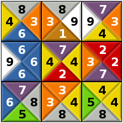
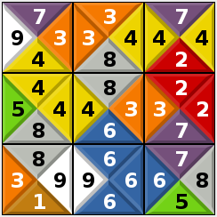

Em um jogo de quebra-cabeça de correspondência de borda é dado uma grade de blocos, onde cada bloco tem um número em cada borda. O objetivo é colocar cada bloco em uma posição apropriada. Um bloco está em uma posição apropriada se os blocos adjacentes (acima, a direita, abaixo e a esquerda) tem o mesmo valor nas bordas adjacentes. Por exemplo, a figura abaixo mostra um jogo inicial com 3 linhas e 3 colunas

{width=3.0cm}

O jogador deve organizar os blocos de maneira que eles fiquem em posições apropriadas, como por exemplo

{width=3.0cm}

Projete um predicado `jogo_solucao(+Jogo, ?Solucao)`{.prolog} que é verdadeiro se `Solucao` é uma solução para o `Jogo`.


# Projeto inicial

No arquivo `jogo.pl` é dado um projeto inicial que deve ser concluído (veja os TODOs no arquivo).

Note que a implementação predicado principal é ingênua. A implementação descreve a solução como uma permutação dos blocos de entrada onde os blocos estão em posições adequadas. Sabendo que o Prolog usa por padrão uma estratégia de busca em profundidade, podemos notar que a busca não será muito eficiente. Isto porque uma permutação inteira da entrada é gerada antes de que qualquer outra restrição seja considerada, então por exemplo, mesmo que os dois blocos iniciais não estejam nas posições adequadas, o Prolog deve que gerar a permutação inteira antes de verificar que os blocos iniciais não estavam certos.

Você deve alterar o predicado principal para que a busca seja eficiente (passe no conjunto de testes `medio` em menos de 1 minuto).

Para executar os testes diretamente você pode usar o comando

```bash
swipl -g 'run_tests(pequeno)' -t halt jogo.pl # executa o conjunto de testes pequeno
swipl -g run_tests -t halt jogo.pl            # executa todos os testes
```
